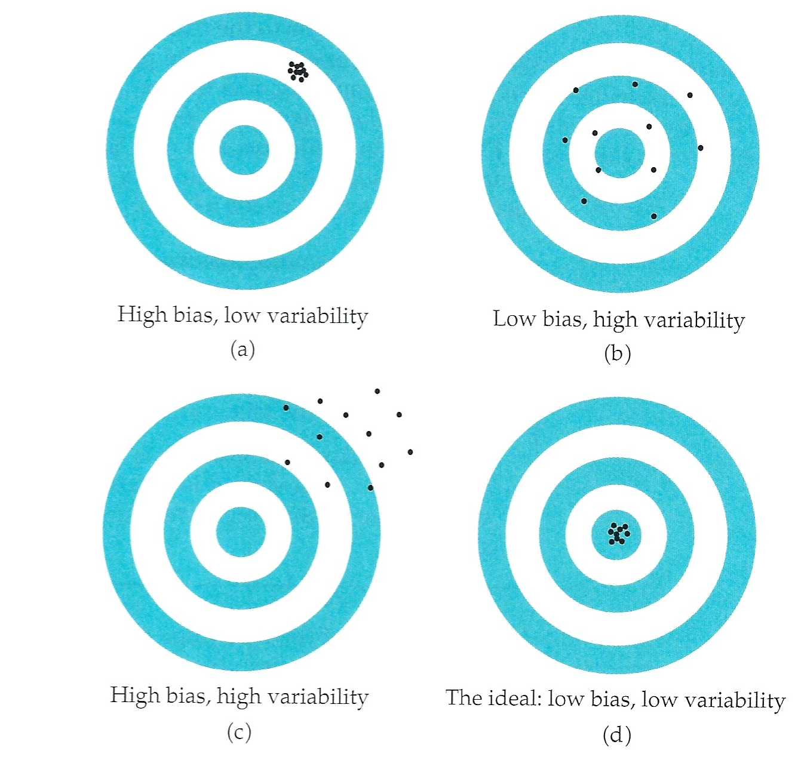
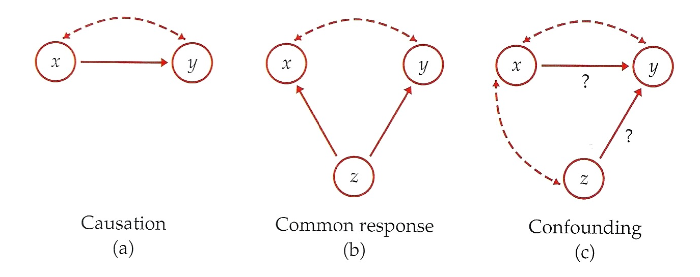

All Statistics is Wrong; Some Statistics is Useful 
========================================================
author: Daniel Kaplan & Nicholas Horton
date: USCOTS May 16, 2013

PROMPT
========================================================
type: prompt

Notes... We're going to talk about the changes we've participated in.

We may each have different personal objectives, and our institutions have different objectives, but there is likely a lot of overlap among us and our institutions.

Making Change Happen
========================================================
type: section

Addressing the Needs of Our Students 

* What do our students need to know to make informed decisions?
   * Personal decisions --- e.g. medical, financial
   * Professional decisions --- e.g. what skills to seek
* What skills will our students need broadly?
   * In the workplace
   * In interpreting the news
   * In relating to scientific findings

The World of Data
========================================================

* Huge amounts of data are being generated,
    * Outside of experimental settings
    * Often without a design.
* Students need to be prepared for a world in which:
    * The economy is more  invested in drawing useful conclusions from data than ever before.
    * Science is more driven by large amounts of data.
    * Personal decisions --- medical, educational --- connect with the research literature.
* Individuals and the media believe that data is knowledge
    * They want to know how to extract useful knowledge from data.
    * They generally are not aware of the limitations of observational data.

Work and Communication
========================================================

* Work is based in teams
    * Collaboration, evaluation, specialization
    * The model of exchanged notes (e.g. email) has broken down
* Publication is instant
    * Old model: Get data, draft, redraft, publish
    * New model: Get data, draft, publish, comment, revise, publish, new data and comment, revise and update, publish, ...
* Topics are more complex
    * From gene to genomics
    * From inventory to logistics
    * From treatment to medical systems
    
Computation is Essential
========================================================

Arithmetic became a standard part of the university curriculum (the "Quadrivium") only in medieval times.
* Improved notation: from Roman numerals to Arabic
* Improved algorithms: place based with a zero
* Improved technology: the slate and pencil
* Increased need: double-entry book-keeping and complex commerce
Eventually, arithmetic moved from a university topic to an elementary topic.

Computational notation, algorithms, technology have improved in our lifetimes.  Need has increased dramatically.

But who is teaching computation?
* If not now, when?
* If not us, who?
    
Statistics is Essential
========================================================

The trends in the evolving world position statistics more centrally than ever.
* But these changes have not been driven by statistics.

Our intellectual and pedagogical model is still rooted in the needs of the laboratory and in the pedagogy of traditional mathematics
* "No causation without experimentation"
* An interest in provable statements and traditional curricula
* "The Ptolemaic Curriculum" of *t*-tests and tables

But Statistics Should Not Be Nihilistic
=========================================================

From <http://XKCD.com/552>

What Do You Think?
=========================================================
type: prompt

We'll have a hand-out with the above four slides printed on one side.

Ask the audience to draw a star by points they agree with and an X through points they disagree with.  

Also feel free to list other trends you think are important and should inform the design of statistics education.

Looking for Inspiration
=========================================================
We need a new source of inspiration and guidance
* Suited for working with data that are dirty, limited, and ambiguous
* Oriented toward decision making and action rather than proof

Epidemiology!
=========================================================

Originated as the study of the spread of disease: epidemics.

Much more broadly construed now:
* The study of the determinants of health and disease for the purpose of useful intervention.

Decisions need to be made
* with data that are limited and dirty
* as quickly as possible
* constructing the best study from available resources
* in the presence of uncontrollable conditions

Ronald Fisher & Austin Bradford Hill
========================================================

Picture of Fisher 

***

Picture of Austin Bradford Hill

PROMPT
========================================================
type: prompt

ABH succeeded RF at president of the Royal Society

Different positions smoking and cancer

> "[I]n passing from association to causation I believe in 'real life' we shall have to consider what flows from that decision. ... In asking for very strong evidence I would, however, repeat emphatically that this does not imply crossing every `t', and swords with every critic, before we act." AB Hill, "The environment and disease: association or causation?" (1965) *Proceedings of the Royal Society of Medicine* 58:295-300 [link](http://www.ncbi.nlm.nih.gov/pmc/articles/PMC1898525/)

Quote about t-tests: "[T]he glitter of the *t* table diverts attention from the inadequacies of the fare."

Graphical Icons of Stats Education
========================================================

***

Suggestions for Other Iconic Stats Graphs
=========================================================
type: prompt

Sketch out one or two graphs you think should be included in the library of Iconic graphs

Our Candidate for Stats Icon
=========================================================
type: section

The "Directed Acyclic Graph"

